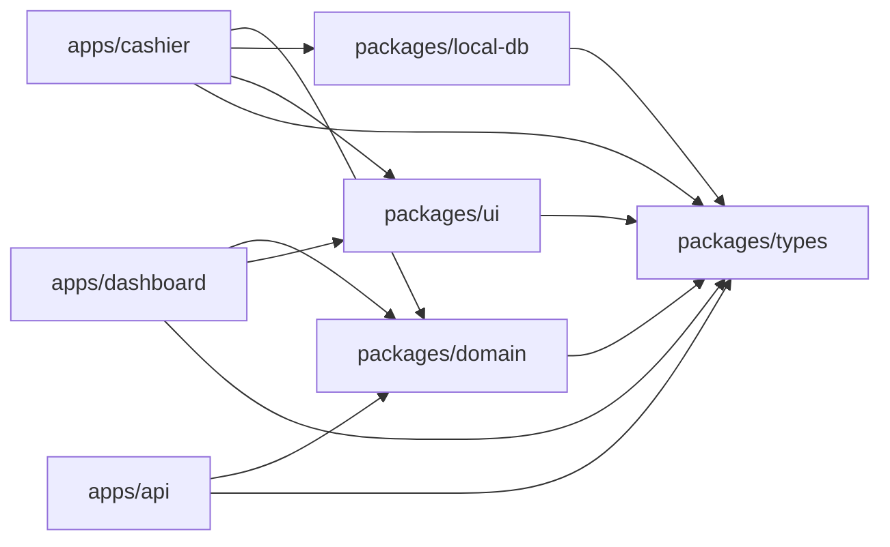
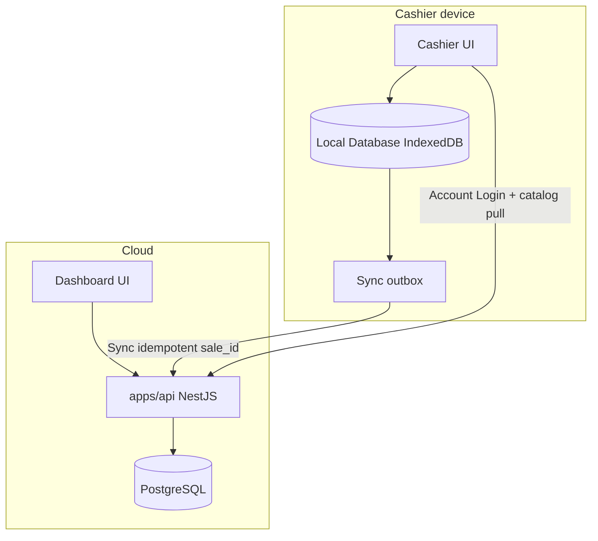
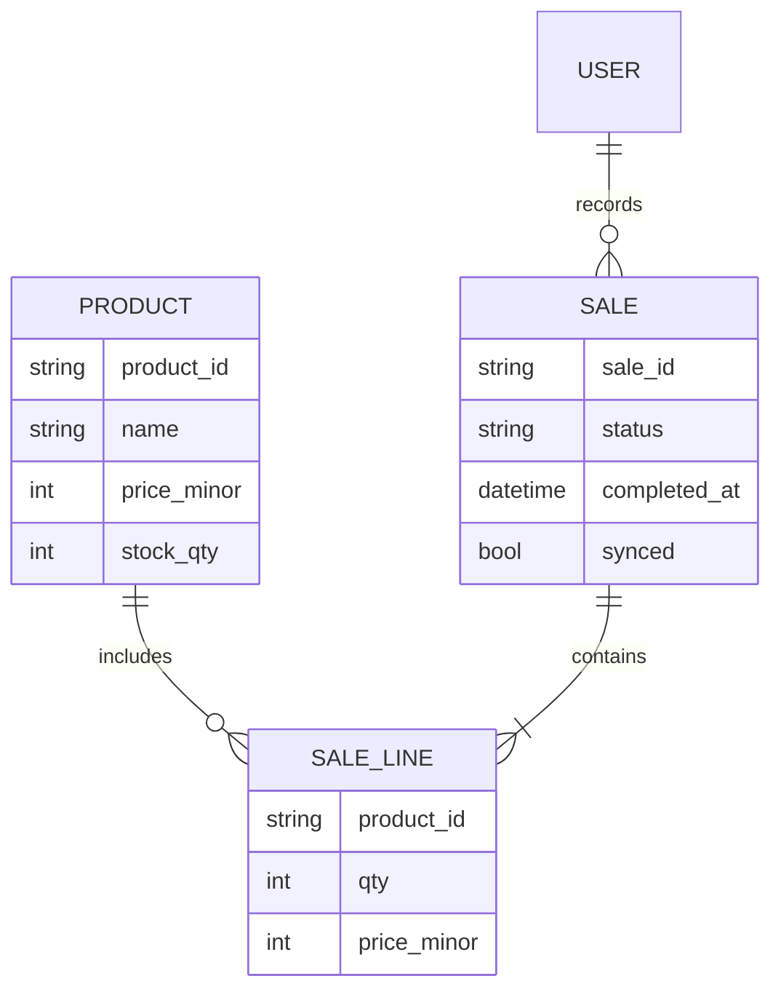

# Architecture Spine — POS Apps Phase 1

## Design Paradigm

**Local-primary offline-first.** Every complete Sale is written first to the Cashier **Local Database**, then uploaded via Sync when online. The **server database** is authoritative for **catalog**, **synced Sales**, and **Dashboard Stock**. Sync is idempotent; it never blocks the next Sale.

```text
packages/domain     # pure Sale/Stock rules (no UI, no DB drivers)
packages/*          # shared types, ui, local-db, api-client
apps/cashier        # PWA · Local Database · Instant Checkout · Offline Mode
apps/dashboard      # online-only · catalog · Stock · sales list
apps/api            # NestJS — Account Login · Sync accept · Stock mutation · catalog API
```

## Invariants & Rules

### AD-1 — Local-primary Sale write path

- **Binds:** UJ-1, UJ-2, FR-6–FR-21, all Sale writes on Cashier
- **Prevents:** Dual paths (“online POST Sale” vs “offline-only local”) that diverge on shape and Stock timing
- **Rule:** Cashier **always** persists Sales in Local Database (online or offline). There is **no** separate “create Sale directly on API” path. When online, Cashier Syncs the outbox immediately after a Sale becomes complete.

### AD-2 — Sale completeness gate `[ADOPTED]` from PRD

- **Binds:** FR-10–FR-12, FR-15, Stock paths
- **Prevents:** Stock decrement or Sync of incomplete Sales
- **Rule:** Sale `status` is `incomplete` | `complete`. **Complete** only after payment recorded **and** Receipt success (print or on-screen confirm). Only `complete` Sales enter the Sync outbox. Incomplete Sales must not mutate server Stock.

### AD-3 — Sync contract

- **Binds:** FR-17–FR-20, NestJS Sync endpoint, Cashier outbox
- **Prevents:** Duplicate server Sales on retry; “pending Sale” UX that contradicts PRD
- **Rule:** Cashier assigns `sale_id` (UUID) before complete. Sync POST is **idempotent on `sale_id`**. Failed Sync retries; Cashier must not block new Sales. Sync status may show “waiting to upload” without marking the Sale incomplete.

### AD-4 — Single Stock mutation command

- **Binds:** FR-11, FR-18, FR-30, Dashboard, NestJS Sales/Sync + Stock modules
- **Prevents:** Two API code paths mutating Stock with different rules; Cashier treating local qty as Dashboard truth
- **Rule:** **Only apps/api** mutates server Stock, and only inside one domain command **`AcceptCompleteSale`** (invoked solely by the Sync/accept endpoint). Dashboard reads server Stock only. Cashier may show optimistic local qty for UX; it is never written to server Stock and is not Dashboard truth. Manual Stock edit on Dashboard (FR-28) is a separate **`AdjustStock`** command — not used by Sync.

### AD-5 — Dependency direction

- **Binds:** all packages and apps
- **Prevents:** Circular app imports; domain rules trapped in React/Nest
- **Rule:** `apps/*` → `packages/*` only. `packages/*` must not import `apps/*`. `packages/domain` must not import UI frameworks, HTTP servers, or DB drivers. Nest modules may orchestrate use-cases but Sale/Stock rules live in `packages/domain`.



### AD-6 — Auth split `[ADOPTED]` from PRD / FR-5

- **Binds:** FR-1–FR-5, UJ-1, UJ-2
- **Prevents:** Offline POS unlock that requires live Account Login every time
- **Rule:** Account Login authenticates against apps/api (online). After success, Cashier persists POS PIN verification material in Local Database. Offline POS PIN unlock uses Local Database only; if material missing, unlock fails clearly.

### AD-7 — Surface separation

- **Binds:** Cashier vs Dashboard capabilities
- **Prevents:** Offline Mode logic leaking into Dashboard; Dashboard usable as offline POS
- **Rule:** Offline Mode and Local Database live only in `apps/cashier`. `apps/dashboard` is online-only and talks only to apps/api.

### AD-8 — Day Close vs Sync `[ADOPTED]` from PRD FR-24

- **Binds:** FR-22–FR-27
- **Prevents:** Day Close finishing while silently dropping unsynced Sales
- **Rule:** Day Close cannot finish while unsynced complete Sales remain unless the cashier explicitly acknowledges; unsynced Sales stay in Local Database for later Sync after next login.

### AD-9 — Catalog refresh into Local Database

- **Binds:** FR-6, FR-29, Cashier Menu
- **Prevents:** Cashier Menu reading live API while Offline Mode reads Local Database with different product sets
- **Rule:** When online, Cashier **pulls** catalog from apps/api into Local Database. Cashier Menu **always** reads products from Local Database (never mixed live API browse for ring-up).

### AD-10 — Line price snapshot on complete

- **Binds:** Sync payload, FR-7, FR-18
- **Prevents:** Sync re-pricing lines from live catalog and disagreeing with Receipt
- **Rule:** At Sale complete, each line stores `price_minor` **snapshot**. Sync and `AcceptCompleteSale` use snapshots; they must not re-price from current catalog.

### AD-11 — Roles

- **Binds:** FR-32
- **Prevents:** Cashier-only accounts editing catalog
- **Rule:** Account roles are at least `cashier` | `catalog_admin`. Only `catalog_admin` may mutate products/Stock via Dashboard. Cashier Account Login cannot call catalog write APIs.

## Consistency Conventions

| Concern | Convention |
| --- | --- |
| IDs | UUID v4 strings for `sale_id`, `product_id`, `user_id`, `device_id` |
| Time | ISO-8601 UTC in APIs and Sync payloads; display local in UI |
| Money | Integer minor units in domain + API; format in UI |
| Sale status | `incomplete` \| `complete` only |
| Errors | `{ code, message }` JSON from NestJS; Cashier maps to UI copy |
| Sync DTO | `{ sale_id, device_id, completed_at, payment: { method, amount_minor }, lines: [{ product_id, qty, price_minor }] }` owned in `packages/types` — Cashier and API must share this type |
| Naming | `packages/<name>`, `apps/<name>`; domain PascalCase types, kebab-case files |
| Auth headers | Bearer access token after Account Login for API; POS PIN is local-only |

## Stack

Seed verified on npm 2026-08-06; code owns versions after install.

| Name | Version |
| --- | --- |
| TypeScript | workspace via starter |
| pnpm + Turborepo | turbo 2.10.x · `pnpm dlx create-turbo@latest` |
| Next.js (cashier, dashboard) | 16.3.x |
| NestJS (api) | @nestjs/core 11.1.x |
| PostgreSQL | 16.x managed |
| Drizzle ORM | 0.45.x |
| idb (IndexedDB) | 8.0.x |
| PWA | Serwist (do not use abandoned next-pwa) |

## Structural Seed

```text
pos-apps/
  apps/
    cashier/          # Next.js PWA — Instant Checkout, Offline Mode, Day Close
    dashboard/        # Next.js — products, Stock, sales list
    api/              # NestJS — AuthModule, CatalogModule, SalesSyncModule, StockModule
  packages/
    domain/           # Sale completeness, AcceptCompleteSale, AdjustStock (pure TS)
    local-db/         # IndexedDB schema + Sync outbox + catalog cache + PIN material
    types/            # shared DTOs including Sync Sale DTO
    ui/               # shared presentational components (optional early)
  turbo.json
  pnpm-workspace.yaml
```





## Capability → Architecture Map

| Capability / Area | Lives in | Governed by |
| --- | --- | --- |
| Account Login + POS PIN | cashier + api + local-db | AD-6, AD-11, FR-1–5 |
| Instant Checkout | cashier + domain | AD-1, AD-2, AD-10, FR-6–13 |
| Catalog on Cashier Menu | cashier local-db ← api pull | AD-9, FR-29 |
| Offline Mode + Sync | cashier local-db + api | AD-1, AD-3, AD-4, FR-14–21 |
| Day Close | cashier | AD-8, FR-22–27 |
| Dashboard products / Stock | dashboard + api | AD-4, AD-7, AD-11, FR-28–32 |
| Receipt print / on-screen | cashier | AD-2, PRD §8 |

## Operations envelope

| Concern | Decision |
| --- | --- |
| Cashier + Dashboard host | Vercel (Next.js) `[ASSUMPTION]` |
| API host | Node process for NestJS (Fly.io / Railway / similar) `[ASSUMPTION]` — exact provider deferred |
| Database | Managed PostgreSQL 16.x (Neon / Railway / similar) `[ASSUMPTION]` — exact provider deferred |
| Environments | `local` · `preview` · `production` at minimum |
| Secrets | API JWT secret, DB URL via host secret store — never in client |

## Deferred

- Exact cloud providers (Fly vs Railway vs Neon) — first infra story
- ESC/POS library / printer matrix — hardware story
- CRDT / multi-cashier conflict resolution — PRD out of scope
- Native shell — only if PWA fails print/offline on chosen device
- Live card gateway / offline card auth
- Kitchen Display / modifiers matrix
- Oversell policy when Sync finds insufficient server Stock — product decision; until then `AcceptCompleteSale` must fail closed with a clear Sync error (Cashier keeps Sale complete locally and surfaces conflict) `[ASSUMPTION]`
- Background Worker app — in-process Nest jobs until queue pain
- Shared UI package depth — extract when duplication hurts
