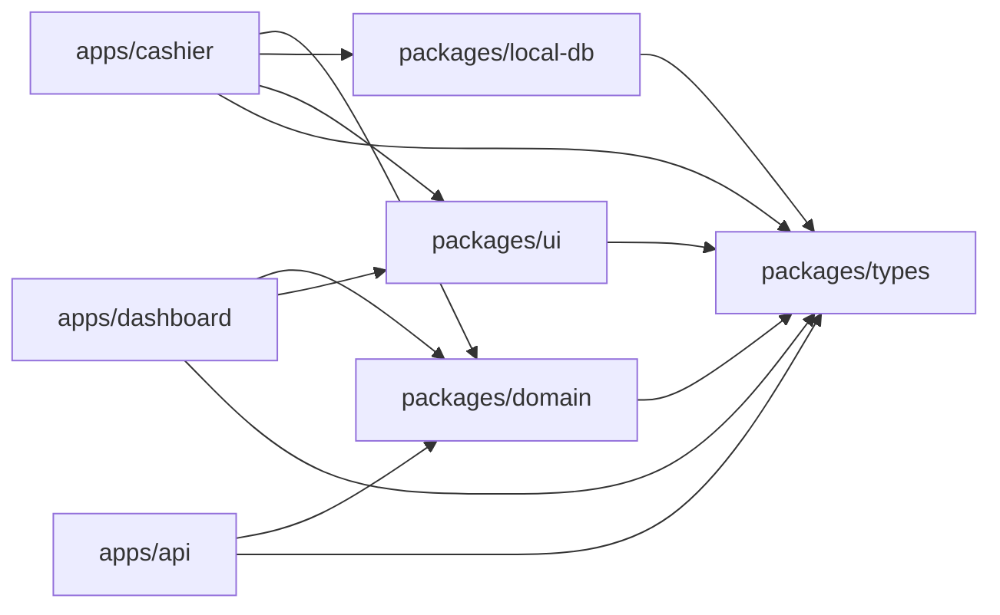
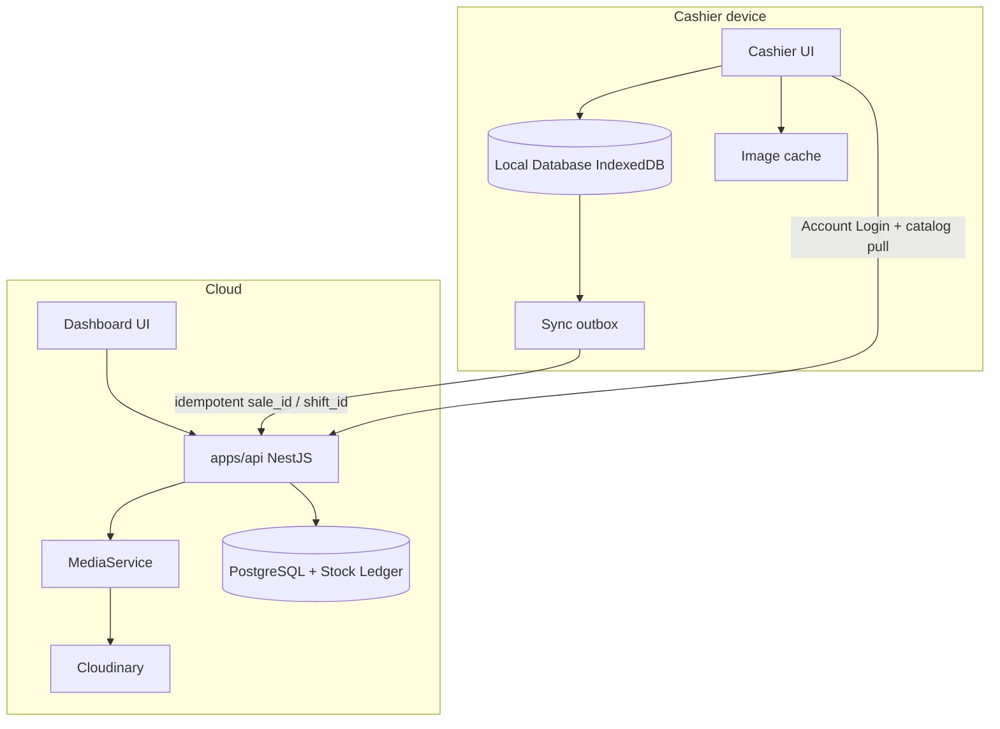
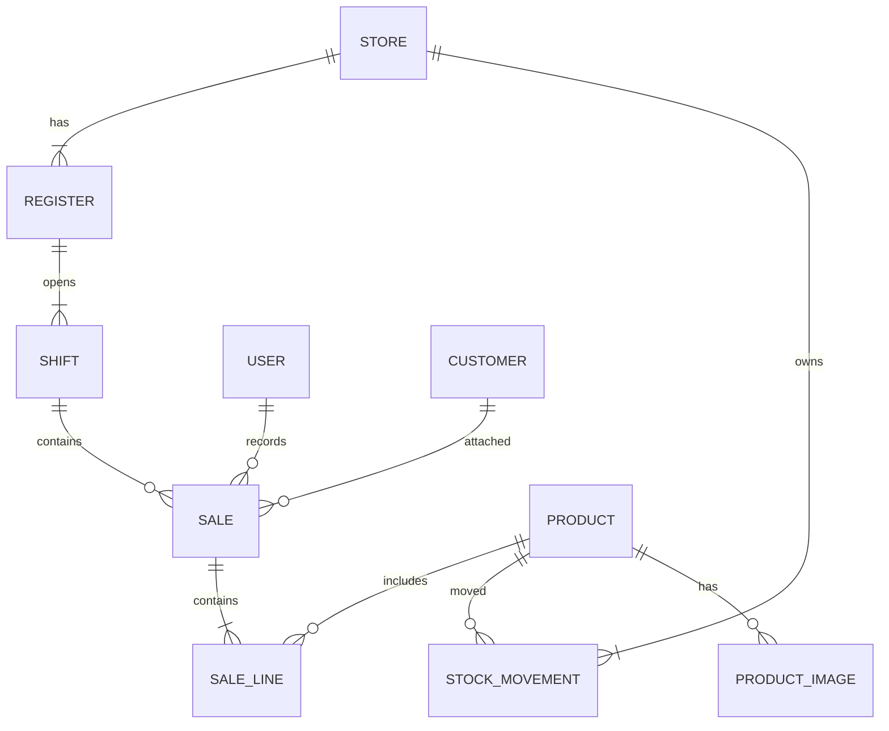

# Architecture Spine — POS Apps Phase 1 + Phase 2

## Design Paradigm

**Local-primary offline-first.** Every complete Sale (and, from 2C, Shift / Void / queued Customer create) is written first to the Cashier **Local Database**, then uploaded via Sync when online. The **server database** is authoritative for **catalog**, **synced documents**, **Stock Ledger**, and Dashboard. Sync is idempotent; it never blocks the next Sale. Dashboard is **online-first**. Media Provider is **infrastructure**, not transaction infrastructure.

```text
packages/domain     # Sale completeness, ledger posting, promo/loyalty eval (no UI, no DB, no Cloudinary)
packages/local-db   # IndexedDB + outbox + catalog/image cache + PIN + Shift
packages/types      # shared DTOs
packages/ui         # presentational only
apps/cashier        # PWA · Instant Checkout · Offline Mode · Shift · Returns (online lookup)
apps/dashboard      # online-only · catalog · Product Media upload · ops
apps/api            # NestJS — Auth/Identity · Catalog · Inventory · Sales/Sync · MediaService · …
```

## Invariants & Rules

### AD-1 — Local-primary Sale write path `[ADOPTED]`

- **Binds:** UJ-1, UJ-2, FR-6–FR-21, all Sale writes on Cashier
- **Prevents:** Dual paths (“online POST Sale” vs “offline-only local”) that diverge on shape and Stock timing
- **Rule:** Cashier **always** persists Sales in Local Database (online or offline). There is **no** separate “create Sale directly on API” path. When online, Cashier Syncs the outbox immediately after a Sale becomes complete.

### AD-2 — Sale completeness gate `[ADOPTED]` from PRD

- **Binds:** FR-10–FR-12, FR-15, Stock paths
- **Prevents:** Stock decrement or Sync of incomplete Sales
- **Rule:** Sale `status` is `incomplete` | `complete`. **Complete** only after payment recorded **and** Receipt success. Only `complete` Sales enter the Sync outbox. Incomplete cancel is **not** Void and posts no ledger. **Void** (`PostVoid`) = same-day reverse of a complete Sale. **Return** (`PostReturn`) = lookup of a complete Sale (online-first). One Sale is reversed by exactly one of: incomplete cancel | Void | Return — never two.

### AD-3 — Sync contract `[ADOPTED]`

- **Binds:** FR-17–FR-20, NestJS Sync endpoint, Cashier outbox
- **Prevents:** Duplicate server Sales on retry; “pending Sale” UX that contradicts PRD
- **Rule:** Cashier assigns `sale_id` (UUID) before complete. Sync POST uses outbox envelope `{ kind, id, payload }` (`kind`: `sale` | `shift` | `void` | `customer_create`) and is **idempotent on (`kind`,`id`)**. Failed Sync retries; Cashier must not block new Sales. Until Sync ack, Local Database is cashier SoT for that complete Sale; Dashboard must not treat it as unreal. After ack, Stock Ledger is server quantity truth.

### AD-4 — Single Stock mutation path `[ADOPTED]` (amended 2A)

- **Binds:** FR-11, FR-18, FR-30, FR-45–FR-48, Dashboard, NestJS Sales/Sync + Inventory
- **Prevents:** Two API code paths mutating quantity with different rules; Cashier treating local qty as Dashboard truth
- **Rule:** **Only apps/api** mutates server quantity, and **only** via these domain commands: `AcceptCompleteSale` (STOCK OUT sellable), `AdjustStock`, `ReceiveGoods` (STOCK IN), `PostVoid` (STOCK IN sellable), `PostReturn` (IN sellable or Damaged per decision), `ApplyOpname`, `ShipTransfer` (sellable → in-transit), `ReceiveTransfer` (in-transit → sellable at B). No other module may INSERT a Stock Movement. Phase 1 `stock_qty` becomes a **projection**. 2A cutover posts one **opening** movement per tracked product. Instant Checkout never fail-closes on qty; negative sellable after accept is allowed (warn). The Phase 1 non-negative DB check is lifted at 2A.

### AD-5 — Dependency direction `[ADOPTED]`

- **Binds:** all packages and apps
- **Prevents:** Circular app imports; domain rules trapped in React/Nest; Cloudinary SDK in cashier
- **Rule:** `apps/*` → `packages/*` only. `packages/*` must not import `apps/*`. `packages/domain` must not import UI frameworks, HTTP servers, DB drivers, or the Cloudinary SDK. Nest modules orchestrate; Sale/Stock/promo/loyalty **rules** live in `packages/domain`.



### AD-6 — Auth split `[ADOPTED]`

- **Binds:** FR-1–FR-5, UJ-1, UJ-2
- **Prevents:** Offline POS unlock that requires live Account Login every time
- **Rule:** Account Login authenticates against apps/api (online). After success, Cashier persists POS PIN verification material in Local Database. Offline POS PIN unlock uses Local Database only; if material missing, unlock fails clearly. POS PIN does not grant extra Permissions beyond the Account Login user.

### AD-7 — Surface separation `[ADOPTED]` (amended Phase 2)

- **Binds:** Cashier vs Dashboard capabilities
- **Prevents:** Offline Mode leaking into Dashboard; a third Phase 2 app; ops screens on Instant Checkout
- **Rule:** Offline Mode and Local Database live only in `apps/cashier`. `apps/dashboard` is online-only and talks only to apps/api. No owner-mobile / warehouse / KDS app is required in Phase 2. Multi-Store is not part of Instant Checkout.

### AD-8 — Day Close vs Sync `[ADOPTED]` from PRD FR-24 / FR-111

- **Binds:** FR-22–FR-27, FR-111
- **Prevents:** Day Close finishing while silently dropping unsynced Sales; a second cash formula fighting Shift
- **Rule:** Day Close cannot finish while unsynced complete Sales remain unless the cashier explicitly acknowledges. After 2C, Day Close cannot finish while a Shift is open; cash summary **displays** closed Shift Expected Cash / counted for this Register — it does not invent a second cash formula.

### AD-9 — Catalog refresh into Local Database `[ADOPTED]` (amended 2A)

- **Binds:** FR-6, FR-29, FR-41, Cashier Menu, Product Media
- **Prevents:** Cashier Menu reading live API/CDN while Offline Mode reads a different catalog
- **Rule:** When online, Cashier **pulls** catalog from apps/api into Local Database, including **durable Product Media cache** (bytes or already-fetched cache entries). Cashier Menu **always** reads products **and** images from Local Database. After a successful refresh, Menu / Checkout / payment / Receipt / Sync must not require a live Media Provider call.

### AD-10 — Line price snapshot on complete `[ADOPTED]`

- **Binds:** Sync payload, FR-7, FR-18, FR-112
- **Prevents:** Sync re-pricing lines from live catalog and disagreeing with Receipt
- **Rule:** At Sale complete, each line stores `price_minor` **snapshot** (after any Customer/Store/Promotion evaluation). Sync and `AcceptCompleteSale` use snapshots; they must not re-price from current catalog.

### AD-11 — Roles `[ADOPTED]` (amended 2D)

- **Binds:** FR-32, FR-98–FR-103
- **Prevents:** Cashier-only accounts editing catalog or Refunding; UI-only Permission checks
- **Rule:** Until 2D, Account roles are `cashier` | `catalog_admin`. Only `catalog_admin` may mutate products/Stock and **approve** PO / Stock Opname / Refund / price. Wave 2D replaces hardcoded roles with resource × action Permissions on JWT; **API enforces** — Dashboard hide/show is not enough. Cashier never creates users. `cashier` → Cashier; `catalog_admin` → Admin (or Store Manager) at mapping (FR-103).

### AD-12 — Media isolation `[ADOPTED]` from PRD / addendum

- **Binds:** FR-39–FR-43, SM-10, SM-C5
- **Prevents:** Checkout or Cashier Menu depending on Cloudinary uptime; Product/Sales modules calling the CDN
- **Rule:** Only `apps/api` **MediaService** talks to Cloudinary (`cloudinary` npm 2.10.x, v2 API). POS DB stores image **references** (public_id, secure_url, metadata). Catalog and Sales modules must not import the Cloudinary SDK. Dashboard uploads via API. Delete = provider delete + DB delete (retry orphans). Dynamic transforms (`q_auto`, `f_auto`); do not store separate pixel-size files.

### AD-13 — Stock Ledger is server quantity truth (2A+)

- **Binds:** FR-44–FR-53, FR-60, FR-66, FR-107–FR-108
- **Prevents:** Free-typed `stock_qty` beside an unused ledger; two quantity truths after cutover
- **Rule:** After 2A cutover, sellable quantity **is** the sum of Stock Movements in bucket `sellable` per product (and Store). Every movement has `bucket`: `sellable` | `damaged` | `in_transit`. Between Shipped and Received, qty is `in_transit` (not sellable at A or B). Sellable identity on a line is the Variant’s `product_id` (parent product is not sold).

### AD-14 — Cashier durable outbox (Phase 2 events)

- **Binds:** FR-62–FR-63, FR-74–FR-80, UJ-8
- **Prevents:** Live POST Shift/Void while Sales stay local-first
- **Rule:** Shift open/close, Cash In / Cash Out, same-day Void, and queued Customer creates use the **same local-first outbox envelope** as Sales (AD-3). Hold/park is **device-local Cart Panel state**, not a Sale and not in the outbox. Receipt-lookup Return and Loyalty **redeem** are **online-first**; Loyalty **earn** runs after Sale Sync. They must not block Instant Checkout if unavailable. Shift close does **not** drain Sync (that remains Day Close / AD-8).

### AD-15 — Nest domain module seams

- **Binds:** apps/api, packages/domain
- **Prevents:** Purchasing stuffed into Catalog; Media SDK imported from Sales
- **Rule:** API modules stay independent by domain: Identity, Catalog, Inventory, Purchasing, Sales, Customers, Promotions, Reports, Stores, Media. Cross-module calls go through domain commands / typed DTOs in `packages/types`, not by reaching into another module’s tables.

### AD-16 — Shift gate (2C+)

- **Binds:** FR-75, FR-111, AcceptCompleteSale
- **Prevents:** Instant Checkout rewritten to optional Shift while SM-9 assumes every Sale has a Shift
- **Rule:** After 2C ships, Cashier Checkout is disabled without an open Shift; `AcceptCompleteSale` **requires** `shift_id`. Phase 1 (no Shift module) is unchanged until this wave. One open Shift per Register.

### AD-17 — API Permission enforcement (2D; catalog_admin until then)

- **Binds:** FR-67, FR-98–FR-102
- **Prevents:** Cashier Refund succeeding because the button was hidden; a second ad-hoc role check in Nest guards
- **Rule:** Every mutating endpoint checks resource × action from the JWT (after 2D). Until 2D, `RolesGuard` on `cashier` | `catalog_admin` is the enforcement (AD-11). UI hide/show is never sufficient. Cashier tokens cannot call user-admin or Refund endpoints.

### AD-18 — Shared promo / loyalty / customer-price eval

- **Binds:** FR-82–FR-92, FR-112
- **Prevents:** Cashier and Dashboard computing different discounts; decorations blocking Instant Checkout
- **Rule:** Promotion, Loyalty, Customer-price, Coupon, and split-tender evaluation live **once** in `packages/domain`. Instant Checkout decorations **fail open**: missing image → placeholder (never block add-to-cart); Loyalty/Promotion/Customer-price unavailable → catalog/Store list price; Customer attach optional; oversell warns. Sale completeness (AD-2) never waits on Media Provider, Loyalty, or Promotion evaluation.

### AD-19 — Store / Register tenancy stub

- **Binds:** FR-104–FR-109
- **Prevents:** 2D activating a Store model Phase 1 never had; cashier picking a Store per line
- **Rule:** Phase 1 data **is** Store #1 + one Register. Sale, Stock Movement, and Shift rows carry `store_id` / `register_id` once the stub exists. Cashier session is bound to one Register. Cross-Store offline Sync is out.

## Consistency Conventions

| Concern | Convention |
| --- | --- |
| IDs | UUID v4 strings for `sale_id`, `product_id`, `user_id`, `device_id`, `store_id`, `register_id`, `shift_id`, `movement_id` |
| Time | ISO-8601 UTC in APIs and Sync payloads; display local in UI |
| Money | Integer minor units in domain + API; format in UI |
| Sale status | `incomplete` \| `complete` only |
| Stock movement | `{ movement_id, product_id, store_id, qty_delta, bucket: sellable\|damaged\|in_transit, reason, source_type, source_id, actor_id, at }` in `packages/types` |
| Errors | `{ code, message }` JSON from NestJS; Cashier maps to UI copy |
| Sync DTO | Outbox `{ kind, id, payload }`. Sale payload: `{ sale_id, device_id, store_id, register_id, shift_id?, completed_at, customer_id?, payments: [{ method, amount_minor }], lines: [{ product_id, qty, price_minor }] }` in `packages/types` |
| Naming | `packages/<name>`, `apps/<name>`; domain PascalCase types, kebab-case files |
| Auth headers | Bearer access token after Account Login for API; POS PIN is local-only |

## Stack

Seed verified 2026-08-13 against installed brownfield + npm (Cloudinary). Code owns versions after install.

| Name | Version |
| --- | --- |
| TypeScript | ^5.8 (workspace) |
| pnpm + Turborepo | pnpm 11.20.0 · turbo ^2.10.0 |
| Next.js (cashier, dashboard) | 16.3.0 |
| React | 19.2.8 |
| NestJS (api) | @nestjs/core ^11.1.0 |
| PostgreSQL | 16.x managed |
| Drizzle ORM | 0.45.1 (drizzle-kit 0.30.6 brownfield) |
| Serwist PWA | @serwist/next ^9.0.14 |
| Cloudinary Node SDK | 2.10.x (v2 API) — **not in lockfile yet**; MediaService only, add at 2A |

## Structural Seed

```text
pos-apps/
  apps/
    cashier/          # Next.js PWA — sell, Offline Mode, Day Close, Shift, Returns lookup
    dashboard/        # Next.js — catalog, media upload, ledger, purchasing, RBAC
    api/              # NestJS — Identity, Catalog, Inventory, Purchasing, Sales, Customers, Promotions, Reports, Stores, Media
  packages/
    domain/           # completeness, AcceptCompleteSale, AdjustStock, ledger post, promo/loyalty eval
    local-db/         # IndexedDB + outbox + catalog/image cache + PIN + Shift
    types/            # DTOs
    ui/               # presentational
```





## Capability → Architecture Map

| Capability / Area | Lives in | Governed by |
| --- | --- | --- |
| Account Login + POS PIN | cashier + api + local-db | AD-6, AD-11, FR-1–5 |
| Instant Checkout | cashier + domain | AD-1, AD-2, AD-10, AD-18, FR-6–13 |
| Catalog + Product Media cache | cashier local-db ← api pull; upload via Dashboard + MediaService | AD-9, AD-12, FR-29, FR-39–43 |
| Offline Mode + Sync | cashier local-db + api | AD-1, AD-3, AD-4, FR-14–21 |
| Day Close | cashier | AD-8, FR-22–27, FR-111 |
| Stock Ledger / Opname | dashboard + api Inventory | AD-4, AD-13, FR-44–54 |
| Purchasing / Goods Receipt | dashboard + api Purchasing | AD-13, AD-15, FR-55–61 |
| Void / Return / Refund | cashier (Void local; Return lookup online) + api Sales | AD-14, AD-11, FR-62–69 |
| Customers / Loyalty | cashier + dashboard + domain | AD-14, AD-18, FR-70–86 |
| Shift | cashier local-db + api | AD-14, AD-16, FR-75–81 |
| Promotions | domain + dashboard + cashier eval | AD-18, AD-10, FR-87–92 |
| RBAC | dashboard + api Identity | AD-11, AD-17, FR-98–103 |
| Multi-Store / Transfer | dashboard + api Stores/Inventory | AD-19, AD-13, FR-104–109 |

## Operations envelope

| Concern | Decision |
| --- | --- |
| Cashier + Dashboard host | Vercel (Next.js) `[ASSUMPTION]` |
| API host | Node process for NestJS — exact provider deferred |
| Database | Managed PostgreSQL 16.x — exact provider deferred |
| Media | Cloudinary cloud (API keys server-only) |
| Environments | `local` · `preview` · `production` at minimum |
| Secrets | API JWT secret, DB URL, Cloudinary keys via host secret store — never in client |

## Deferred

- Exact cloud providers (Vercel/Fly/Railway/Neon) — first infra story still open
- ESC/POS library / printer matrix — hardware story
- CRDT / multi-cashier / cross-Store offline Sync — PRD out
- Native shell — only if PWA fails print/offline
- Live card gateway / offline card auth
- Kitchen Display / modifier matrix beyond Variants
- Oversell-on-Sync: Instant Checkout never hard-blocks (AD-4, AD-18). Conflict-report UI deferred
- UUID scheme stays v4 to match brownfield `defaultRandom()` — do not switch to v7 in Phase 2
- Hold/park shared Register queue — PRD OQ; default device-local (AD-14)
- Background Worker — in-process Nest jobs until queue pain (Cloudinary delete retry may be the first job)
- Owner mobile / warehouse / KDS / public API — prepare seams only (AD-7)
- Custom RBAC roles — optional in 2D, not a gate
- Costing method beyond product cost field
